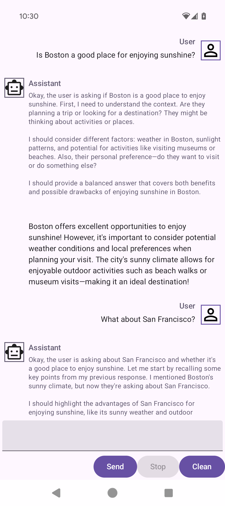

LeapChat - AI Story Generator for Android
===
This Android app demonstrates how to use the Leap SDK to create an AI-powered story generator on device. The app generates creative stories based on user prompts using Liquid AI's Leap SDK for on-device inference.

## Features
* **On-Device AI**: Runs entirely on device using Leap SDK - no internet connection required after model download
* **Story Generation**: Creates structured stories with characters, settings, plots, and conclusions
* **XML-Parsed Stories**: Uses structured XML responses for consistent story formatting
* **Real-time Generation**: Shows generation progress with streaming responses
* **Error Handling**: Comprehensive error handling with user-friendly messages

## Architecture
The app follows a clean architecture with the following components:

* **MainActivity.kt**: Main UI and model management
* **StoryGenerationService.kt**: Handles story generation using Leap SDK
* **StoryXmlParser.kt**: Parses XML-structured story responses
* **Story.kt**: Data models for story components
* **StoryDisplay.kt**: UI component for displaying generated stories

## Leap SDK Integration

### Dependencies
The app uses Leap SDK version 0.4.0:
```kotlin
implementation("ai.liquid.leap:leap-sdk:0.4.0")
implementation("ai.liquid.leap:leap-gson:0.4.0")
implementation("ai.liquid.leap:leap-model-downloader:0.4.0")
```

### Model Loading
The app follows the official Leap SDK v0.4.0 workflow:

```kotlin
// No explicit initialization needed for v0.4.0

// Load model using LeapClient (suspend function)
val modelRunner = LeapClient.loadModel("/data/local/tmp/leap/model.leap")

// Create conversation from model runner
val conversation = modelRunner.createConversation()

// Generate streaming response
val response = conversation.generateResponse(userPrompt = prompt)
response.collect { messageResponse ->
    when (messageResponse) {
        is MessageResponse.Chunk -> {
            // Handle text chunks as they arrive
            val chunkText = messageResponse.text
        }
        is MessageResponse.Complete -> {
            // Generation completed
        }
    }
}
```

### Story Generation Flow
1. **Prompt Processing**: User enters a story prompt
2. **Outline Generation**: AI generates story outline in XML format using Leap SDK
3. **XML Parsing**: Parse outline for characters, settings, plot, and conclusion
4. **Iterative Generation**: Generate story sections iteratively with streaming responses
5. **Story Assembly**: Combine sections into complete story

## Complete Workflow: Creating and Running .leap Models

### Step 1: Get a .leap Model File
1. **Visit Leap Model Library**: Go to [https://leap.liquid.ai/models](https://leap.liquid.ai/models)
2. **Select a Model**: Choose a model suitable for creative writing (e.g., LFM-2-1.7B, Qwen2.5-7B)
3. **Download**: Click download to get the `.leap` bundle file

### Step 2: Prepare Your Android Device
1. **Enable Developer Mode**: Go to Settings → About Phone → Tap Build Number 7 times
2. **Enable USB Debugging**: Settings → Developer Options → USB Debugging
3. **Connect Device**: Connect via USB cable

### Step 3: Transfer Model to Device
```bash
# Create directory on device
adb shell mkdir -p /data/local/tmp/leap/

# Push model file (replace 'model.leap' with your actual filename)
adb push ~/Downloads/model.leap /data/local/tmp/leap/model.leap

# Verify transfer
adb shell ls -la /data/local/tmp/leap/
```

### Step 4: Configure Your App
Update `MainActivity.kt` to point to your model:
```kotlin
private val BUNDLED_MODEL_ASSET_NAME = "/data/local/tmp/leap/model.leap"
```

### Step 5: Build and Run
```bash
./gradlew assembleDebug
adb install app/build/outputs/apk/debug/app-debug.apk
adb shell am start -n ai.liquid.leapchat/.MainActivity
```

### Step 6: Generate Stories
1. **Launch the app** - it will load the model automatically
2. **Enter a prompt** - e.g., "A cat in a hat goes to Neverland"
3. **Tap "Generate Story"** - watch the streaming generation
4. **View structured story** - characters, settings, plot, and narrative

### Troubleshooting
- **Model Loading Fails**: Check file path and permissions
- **Out of Memory**: Ensure device has 3GB+ RAM available
- **Generation Errors**: Verify model compatibility with Leap SDK v0.4.0
- **Slow Performance**: Close other apps, ensure device is not overheating

### Model Management
- **Storage**: Models are 1-7GB, store in `/data/local/tmp/leap/`
- **Caching**: The app caches loaded models for faster subsequent loads
- **Updates**: Download new model versions from Leap Model Library
- **Cleanup**: Remove old models with `adb shell rm /data/local/tmp/leap/old_model.leap`

## Getting Started

### Prerequisites
* Android API 31+ (ARM64 required)
* Leap SDK access and API keys (if downloading models)
* Kotlin 1.9.0+

### Setup
1. Clone the repository
2. Add your Leap SDK credentials to `local.properties` or environment
3. Build and run on ARM64 device

### Adding a Model File

#### Option 1: Using a Pre-bundled Model
1. **Download a `.leap` model file** from the [Leap Model Library](https://leap.liquid.ai/models)
2. **Place the model file** in `app/src/main/assets/`
3. **Update the model name** in MainActivity.kt:
   ```kotlin
   private val BUNDLED_MODEL_ASSET_NAME = "your_model_file.leap"
   ```

#### Option 2: Download and Push Model to Device (Recommended)
1. **Download a model bundle** from [Leap Model Library](https://leap.liquid.ai/models)
   - Look for models with `.leap` extension
   - Recommended models: LFM-2-1.7B, Qwen2.5-7B, or similar creative writing models

2. **Connect your Android device** and enable USB debugging

3. **Push model to device using ADB**:
   ```bash
   # Create directory on device
   adb shell mkdir -p /data/local/tmp/leap/

   # Push model file (assuming downloaded to ~/Downloads/)
   adb push ~/Downloads/your_model.leap /data/local/tmp/leap/model.leap
   ```

4. **Update the model path** in MainActivity.kt:
   ```kotlin
   private val BUNDLED_MODEL_ASSET_NAME = "/data/local/tmp/leap/model.leap"
   ```

#### Option 3: Automatic Model Download
If no bundled model is found, the app will create a placeholder model. For production use, always use Option 1 or 2 with real model files.

### Model Requirements
- **Format**: `.leap` bundle files from Leap Model Library
- **Architecture**: ARM64 (`arm64-v8a`) compatible
- **RAM**: Minimum 3GB recommended
- **Storage**: Model files are typically 1-7GB in size

## Usage

1. **Launch App**: The app will automatically start loading the AI model
2. **Enter Prompt**: Type a story prompt (e.g., "A cat in a hat goes to Neverland")
3. **Generate Story**: Tap "Generate Story" to create your story
4. **View Results**: The app displays the generated story with structured sections:
   - Characters
   - Settings
   - Plot with twists
   - Story narrative
   - Conclusion

## Story Structure
Generated stories follow this XML structure:
```xml
<story>
    <characters>
        <character name="Cat in Hat" role="protagonist" traits="adventurous,mysterious,playful"/>
    </characters>
    <settings>
        <setting id="1" name="Cozy Bedroom" time="night" mood="peaceful"/>
    </settings>
    <plot>
        <problem>Getting lost on the way to Neverland</problem>
        <twists>
            <twist setting="2">Meeting a wise old owl who offers guidance</twist>
        </twists>
    </plot>
    <conclusion>Returning home with magical memories and new friends</conclusion>
</story>
```

## Screenshot

